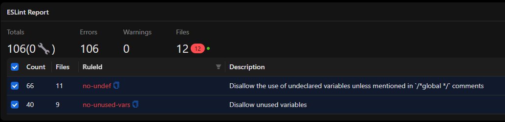
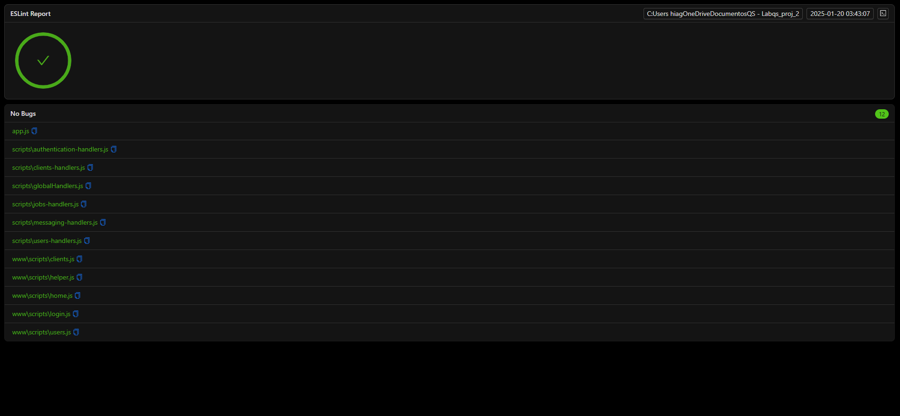
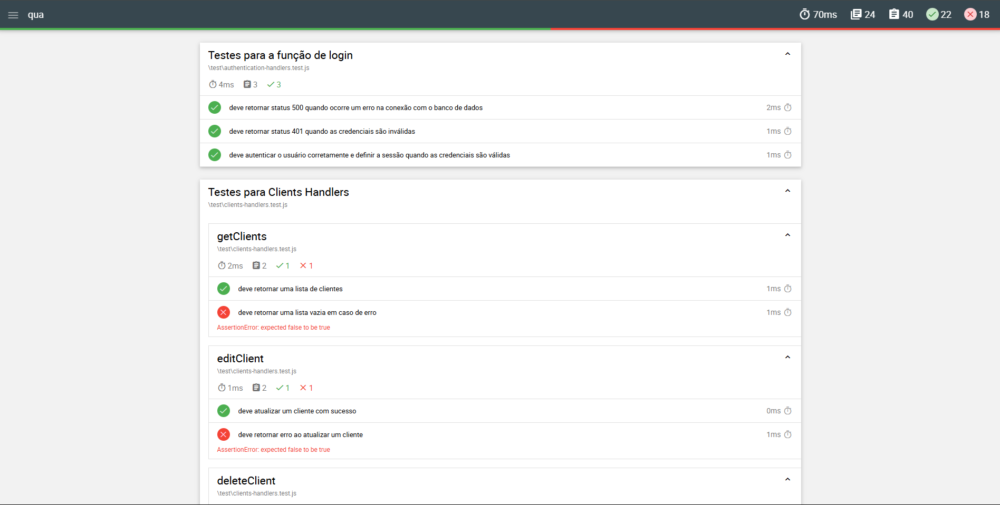
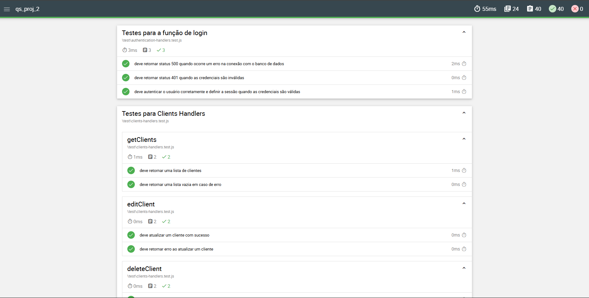

# RELATÓRIO DE QUALIDADE DE SOFTWARE PARA APLICAÇÃO REPARAÇÃO DE COMPONENTES ELETRÔNICOS

## Sumário
1. [Contextualização Sobre a Aplicação](#1-contextualização-sobre-a-aplicação)
2. [Extração de Requisitos](#2-extração-de-requisitos)
    - [Requisitos Funcionais](#21-requisitos-funcionais)
    - [Requisitos Não Funcionais](#22-requisitos-não-funcionais)
    - [Proposta de Requisitos Adicionais](#23-proposta-de-requisitos-adicionais)
3. [Correção com o ESLint](#3-correção-com-o-eslint)
    - [O que é o ESLint?](#31-o-que-é-o-eslint)
    - [Configuração do ESLint no Projeto](#32-configuração-do-eslint-no-projeto)
    - [Resultados da Análise com o ESLint](#33-resultados-da-análise-com-o-eslint)
    - [Impacto dos Erros Identificados](#34-impacto-dos-erros-identificados)
4. [Testes Automatizados com Mocha e Chai](#4-testes-automatizados-com-mocha-e-chai)
    - [Introdução ao Mocha e Chai](#41-introdução-ao-mocha-e-chai)
    - [Configuração do Mocha](#42-configuração-do-mocha)
    - [Estrutura dos Testes](#43-estrutura-dos-testes)
    - [Exemplo de Teste: `authentication-handlers.test.js`](#44-exemplo-de-teste-authentication-handlerstestjs)
    - [Resultados dos Testes](#45-resultados-dos-testes)
    - [Melhorias Implementadas](#46-melhorias-implementadas)
5. [Análise da Aplicação com a ISO/IEC 25010](#5-análise-da-aplicação-com-a-isoiec-25010)
    - [Explorando a ISO/IEC 25010](#51-explorando-a-isoiec-25010)
    - [Crítica ao Projeto sob a Ótica da ISO/IEC 25010](#52-crítica-ao-projeto-sob-a-ótica-da-isoiec-25010)
        - [Funcionalidade](#521-funcionalidade)
        - [Confiabilidade](#522-confiabilidade)
        - [Usabilidade](#523-usabilidade)
        - [Eficiência](#524-eficiência)
        - [Manutenibilidade](#525-manutenibilidade)
        - [Segurança](#526-segurança)
        - [Compatibilidade](#527-compatibilidade)
6. [Conclusão](#6-conclusão)

## 1. Contextualização Sobre a Aplicação

A aplicação em análise é um sistema de gestão desenvolvido para atender às necessidades de um ambiente de reparação técnica, oferecendo ferramentas para gerenciamento de clientes, usuários e trabalhos (jobs). Seu principal objetivo é simplificar e automatizar processos, permitindo que os usuários realizem operações de forma eficiente e organizada. A aplicação é composta por várias funcionalidades interligadas, que vão desde a autenticação de usuários até a comunicação interna em tempo real, passando pela criação, edição e exclusão de registros.

No cerne da aplicação, encontramos uma interface intuitiva e responsiva, que permite aos usuários navegarem entre diferentes páginas, como a página de login, a página inicial (home), a página de clientes e a página de usuários. A página de login é responsável por autenticar os usuários, garantindo que apenas pessoas autorizadas tenham acesso ao sistema. Após o login, os usuários são redirecionados para a página inicial, onde podem visualizar e gerenciar trabalhos, incluindo a criação de novos jobs, a edição de informações existentes e a reabertura de trabalhos concluídos. A página de clientes permite o cadastro e gerenciamento de informações de clientes, como nome, email, morada, código postal e NIF. Já a página de usuários é destinada à administração de contas, permitindo a criação, edição e exclusão de usuários, além da definição de permissões de acesso.

A aplicação utiliza uma variedade de tecnologias modernas para garantir seu funcionamento eficiente. No front-end, são empregados HTML, CSS e JavaScript, com o auxílio de bibliotecas como jQuery e Bootstrap para facilitar a criação de interfaces responsivas e interativas. O uso de DataTables permite a exibição de dados em tabelas dinâmicas, com funcionalidades como paginação, ordenação e busca. No back-end, a aplicação é construída com Node.js e Express, que fornecem uma estrutura robusta para o desenvolvimento de APIs e o gerenciamento de rotas. A comunicação com o banco de dados é realizada através do MySQL, onde são armazenadas todas as informações necessárias para o funcionamento do sistema, como dados de usuários, clientes e trabalhos.

Uma das funcionalidades mais interessantes da aplicação é a integração com WebSocket, que permite a comunicação em tempo real entre os usuários. Essa funcionalidade é especialmente útil para enviar e receber mensagens instantâneas, facilitando a colaboração e a resolução de problemas em um ambiente de trabalho dinâmico. O WebSocket é configurado para funcionar em conjunto com o servidor HTTP, garantindo que as mensagens sejam transmitidas de forma rápida e eficiente.

Apesar de sua estrutura bem planejada, a aplicação apresenta alguns pontos que necessitam de atenção. Por exemplo, a funcionalidade de login automático, que tenta autenticar usuários pré-definidos com base no navegador utilizado, pode não funcionar corretamente em todos os cenários. Além disso, a validação de campos em formulários, como email e senha, pode não estar sendo realizada de forma consistente, o que pode levar a erros ou inconsistências nos dados. A funcionalidade de priorização de trabalhos, que permite aos usuários arrastarem e soltar itens para reordenar prioridades, também pode apresentar problemas de funcionamento. Por fim, a exclusão de registros, como usuários e clientes, pode não estar sendo tratada de forma adequada quando há dependências no banco de dados, como trabalhos associados a um cliente.

Este relatório tem como objetivo fornecer uma visão detalhada da aplicação, destacando seus pontos fortes e identificando áreas que necessitam de melhorias. Através da análise dos requisitos funcionais e não funcionais, bem como da avaliação das tecnologias utilizadas, esperamos contribuir para o aprimoramento do sistema, garantindo que ele continue a atender às necessidades dos usuários de forma eficiente e segura.

## 2. Extração de Requisitos

Este capítulo descreve os requisitos funcionais e não funcionais identificados para a aplicação voltada ao aluguer de carrinhos. Os requisitos foram definidos com base nas necessidades dos usuários e nas características esperadas do sistema, garantindo que a aplicação atenda tanto às funcionalidades específicas quanto aos padrões de qualidade e desempenho esperados. Os requisitos estão divididos em dois grupos: funcionais, que detalham as funcionalidades diretamente observáveis pelos usuários, e não funcionais, que definem os critérios técnicos e de qualidade para o sistema.

A identificação e a organização desses requisitos são etapas cruciais no processo de desenvolvimento de software, permitindo uma abordagem sistemática na construção do sistema e na avaliação de sua adequação às expectativas.

### 2.1. Requisitos Funcionais

Os requisitos funcionais descrevem as capacidades que o sistema deve possuir para cumprir seus objetivos operacionais. Eles definem as funcionalidades principais que serão diretamente utilizadas pelos usuários. No contexto da aplicação de aluguel de carrinhos, foram identificados os seguintes requisitos:

1. Acessar Aplicação: Permitir que os usuários façam login com nome de usuário/email e senha. Após o login bem-sucedido, o usuário seja redirecionado para a página inicial (home.html). O acesso a páginas restritas é bloqueado sem autenticação.
2.	Sair da Aplicação: Permitir que os usuários façam logout, encerrando a sessão e redirecionando para a página de login.
3.	Controlar Acesso: Restringir o acesso à página de usuários (users.html) apenas para administradores. Usuários comuns não podem acessar essa funcionalidade.
4.	Criar Usuários: Permitir que administradores criem usuários, definindo nome, nome de usuário, email, tipo de usuário (administrador ou operador) e senha.
5.	Editar Usuários: Permitir que administradores editem informações de usuários existentes, como nome, email e tipo de usuário.
6.	Excluir Usuários: Permitir que administradores excluam usuários do sistema.
7.	Listar Usuários: Exibir uma tabela com todos os usuários cadastrados, incluindo nome, nome de usuário, email, tipo de acesso e número de trabalhos associados.
8.	Criar Clientes: Permitir que usuários cadastrem novos clientes, definindo nome, email, morada, código postal e NIF.
9.	Editar Clientes: Permitir que usuários editem informações de clientes existentes.
10.	Excluir Clientes: Permitir que usuários excluam clientes do sistema.
11.	Listar Clientes: Exibir uma tabela com todos os clientes cadastrados, incluindo nome, email, NIF e número de trabalhos associados.
12.	Criar Trabalhos: Permitir que usuários criem trabalhos, definindo tipo de equipamento, marca, procedimento de reparação, notas, status e prioridade.
13.	Editar Trabalhos: Permitir que usuários editem informações de trabalhos existentes, incluindo status e prioridade.
14.	Reabrir Trabalhos: Permitir que usuários reabram trabalhos concluídos.
15.	Listar Trabalhos: Exibir uma tabela com todos os trabalhos, incluindo ID, descrição, criado por cliente, status, prioridade e notas.
16.	Priorizar Trabalhos: Permitir que usuários arrastem e soltem trabalhos para reordenar prioridades.
17.	Enviar Mensagens: Permitir que usuários enviem mensagens para outros usuários via WebSocket.
18.	Receber Mensagens: Exibir mensagens recebidas em tempo real.
19.	Observar Histórico Mensagens: Carregar o histórico de mensagens ao selecionar um usuário.
20.	Navegar: Fornece uma barra de navegação com links para as páginas de home, clientes e usuários (dependendo do nível de acesso).
21.	Observar Modais: Usar modais para criação, edição e exclusão de usuários, clientes e trabalhos.
22.	Validar Formulários: Validar campos obrigatórios e formatos de email, senha etc.
23.	Acessar de Forma Automática: O código tenta fazer login automaticamente com usuários pré-definidos (nunesd e renatoreis) dependendo do navegador. Isso pode não funcionar corretamente em todos os cenários.

### 2.2. Requisitos Não Funcionais

Os requisitos não funcionais descrevem as qualidades e restrições técnicas que o sistema deve respeitar. Eles asseguram que a aplicação não apenas funcione como esperado, mas também atenda a critérios de eficiência, usabilidade e compatibilidade. Para a aplicação de aluguer de carrinhos, foram definidos os seguintes requisitos não funcionais:

1.	Tempo de Resposta: A aplicação deve responder a requisições em menos de 2 segundos.
2.	Escalabilidade: A aplicação deve suportar até 100 usuários simultâneos.
3.	Autenticação Segura: As senhas devem ser armazenadas de forma segura (hash) no banco de dados.
4.	Proteção contra ataques: Implementar proteção contra SQL injection, XSS e CSRF.
5.	Controle de Sessão: As sessões devem ser gerenciadas de forma segura, com tempo de expiração e regeneração de IDs de sessão.
6.	Interface Responsiva: A interface deve ser responsiva e funcionar bem em dispositivos móveis e desktops.
7.	Feedback ao Usuário: Fornecer mensagens de erro claras e feedback visual para ações do usuário.
8.	Código Modular: O código deve ser modular, com separação clara entre front-end e back-end.
9.	Documentação: Manter documentação atualizada para facilitar a manutenção e o desenvolvimento futuro.
10.	Compatibilidade com Navegadores: A aplicação deve funcionar corretamente nos principais navegadores (Chrome, Firefox, Edge, Safari).

Com base nesses requisitos, busca-se assegurar que a aplicação ofereça uma experiência de uso satisfatória, atenda às necessidades funcionais específicas e esteja em conformidade com padrões de qualidade técnica. Essa estrutura de requisitos funcionais e não funcionais contribui para o desenvolvimento de uma solução robusta e eficiente.	

### 2.3. Proposta de Requisitos Adicionais

Aqui é apresentado uma proposta de requisitos adicionais para a aplicação de aluguel de carrinhos, identificados como melhorias ou novas funcionalidades que poderiam ampliar a eficiência, a segurança e a experiência do usuário. Os requisitos foram divididos em funcionais, que detalham novas capacidades diretamente visíveis e utilizáveis pelo usuário, e não funcionais, que estabelecem melhorias técnicas relacionadas à qualidade do sistema.

A introdução de novos requisitos busca não apenas expandir as funcionalidades da aplicação, mas também assegurar que a solução tecnológica continue a atender às demandas crescentes de segurança, usabilidade e praticidade. A seguir, os requisitos propostos são detalhados.

Os **requisitos não funcionais** adicionais visam melhorar a segurança e a usabilidade do aplicativo, garantindo maior confiabilidade e uma experiência mais agradável para os usuários:

1.	Recuperação de Senha: Permitir que os usuários recuperem suas senhas caso as esqueçam, enviando um link de redefinição por email.
2.	Perfil do Usuário: Adicionar uma página de perfil onde os usuários possam visualizar e editar suas informações pessoais, como nome, email e senha.
3.	Exportação de Dados: Permitir que os usuários exportem dados (clientes, trabalhos, usuários) em formatos como CSV ou PDF.
4.	Filtros Avançados na Listagem: Adicionar filtros avançados nas tabelas de clientes, usuários e trabalhos, permitindo buscar por status, prioridade, data etc.
5.	Notificações: Implementar um sistema de notificações para alertar os usuários sobre novas mensagens, atualizações de trabalhos ou prazos.
6.	Relatórios: Gerar relatórios detalhados sobre trabalhos concluídos, pendentes, tempo médio de reparação etc.
7.	Integração com E-mail: Enviar notificações por email para clientes quando um trabalho é criado, atualizado ou concluído.
8.	Histórico de Alterações: Manter um histórico de alterações para trabalhos, clientes e usuários, mostrando quem fez a alteração e quando.
9.	Autenticação de Dois Fatores (2FA): Adicionar uma camada extra de segurança com autenticação de dois fatores para o login.
10.	Suporte a Múltiplos Idiomas: Implementar suporte a múltiplos idiomas para tornar a aplicação acessível a usuários internacionais.

Os **requisitos funcionais** propostos visam introduzir novas capacidades ao sistema, aumentando sua utilidade e abrangência para os usuários:

1.	Backup Automático: Implementar um sistema de backup automático do banco de dados para evitar perda de dados.
2.	Monitoramento de Desempenho: Adicionar ferramentas de monitoramento para acompanhar o desempenho da aplicação e identificar gargalos.
3.	Testes Automatizados: Implementar testes automatizados (unitários, de integração e de interface) para garantir a qualidade do código.
4.	Logs Detalhados: Manter logs detalhados de todas as ações realizadas na aplicação para facilitar a depuração e auditoria.
5.	Segurança Avançada: Implementar medidas adicionais de segurança, como criptografia de dados em trânsito e em repouso.
6.	Documentação da API: Criar documentação detalhada da API para facilitar a integração com outros sistemas.
7.	Limitação de Tentativas de Login: Bloquear temporariamente contas após um número máximo de tentativas de login falhas para prevenir ataques de força bruta.
8.	Política de Privacidade e Termos de Uso: Adicionar páginas de política de privacidade e termos de uso para garantir conformidade com regulamentações.
9.	Suporte a Alta Disponibilidade: Garantir que a aplicação esteja disponível 24/7, com redundância de servidores e balanceamento de carga.
10.	Otimização para SEO: Melhorar a visibilidade da aplicação em mecanismos de busca, caso seja uma aplicação pública.

Os requisitos adicionais propostos visam aumentar a eficiência operacional da aplicação e proporcionar maior satisfação ao usuário. As melhorias sugeridas em segurança e usabilidade são especialmente relevantes em um contexto em que a proteção de dados e a experiência do usuário são aspectos centrais para a aceitação de uma solução tecnológica. Já as novas funcionalidades permitem ampliar a abrangência do serviço, oferecendo capacidades que alinham a aplicação às expectativas modernas de praticidade e inovação. A implementação desses requisitos representaria um avanço significativo no ciclo evolutivo do sistema.

## 3. Correção com o ESLint

### 3.1. O que é o ESLint?

O **ESLint** é uma ferramenta de análise estática de código amplamente utilizada para identificar e corrigir problemas em códigos JavaScript. Ele ajuda a manter a consistência do código, aplicando regras de estilo e boas práticas de programação. O ESLint é altamente configurável, permitindo que equipes de desenvolvimento definam suas próprias regras ou utilizem configurações pré-definidas, como as do **ESLint Recommended** ou de plugins como o **Airbnb JavaScript Style Guide**.

Além de identificar erros de sintaxe, o ESLint pode detectar problemas como variáveis não declaradas, uso de funções obsoletas, más práticas de programação e até mesmo problemas de segurança. Ele é uma ferramenta essencial para garantir a qualidade do código, especialmente em projetos grandes ou com múltiplos desenvolvedores.


### 3.2. Configuração do ESLint no Projeto

No projeto em análise, o ESLint foi configurado para analisar os arquivos JavaScript nas pastas `www/scripts/` e `scripts/`, além do arquivo `app.js`. A configuração utilizada é a seguinte:

```javascript
import globals from "globals";
import pluginJs from "@eslint/js";

/** @type {} */
export default [
  {
    files: ["**/www/scripts/*.js", "**/scripts/*.js"],
    languageOptions: {
      sourceType: "module",
      globals: {
        ...globals.browser,
        ...globals.jquery,
      },
    },
  },
  pluginJs.configs.recommended,
];
```

#### Detalhes da Configuração:
1. **Arquivos Analisados**:
   - A configuração aplica-se a todos os arquivos JavaScript (`*.js`) nas pastas `www/scripts/` e `scripts/`.
2. **Ambiente**:
   - O ESLint foi configurado para reconhecer variáveis globais específicas de navegadores (`globals.browser`) e do jQuery (`globals.jquery`), o que é útil para projetos que utilizam essas tecnologias.
3. **Regras Recomendadas**:
   - A configuração utiliza as regras recomendadas do ESLint (`pluginJs.configs.recommended`), que são um conjunto de boas práticas amplamente aceitas na comunidade JavaScript.


### 3.3. Resultados da Análise com o ESLint

A análise do ESLint identificou **106 erros** em **12 arquivos** JavaScript. Esses erros podem ser categorizados em diferentes tipos, como:

1. **Erros de Sintaxe**:
   - Uso incorreto de ponto e vírgula (`;`).
   - Parênteses, colchetes ou chaves mal fechados.
   - Uso incorreto de aspas simples (`'`) ou duplas (`"`).

2. **Problemas de Estilo**:
   - Indentação inconsistente (espaços vs. tabs).
   - Linhas muito longas, excedendo o limite recomendado de caracteres.
   - Uso de variáveis não declaradas ou declaradas mas não utilizadas.

3. **Boas Práticas**:
   - Uso de funções obsoletas ou desencorajadas.
   - Falta de tratamento de erros em operações assíncronas.
   - Uso de `==` em vez de `===` para comparações estritas.

4. **Problemas de Segurança**:
   - Uso de `eval()` ou funções semelhantes que podem introduzir vulnerabilidades.
   - Falta de validação de entradas do usuário em operações críticas.



### 3.4. Impacto dos Erros Identificados

Os erros identificados pelo ESLint podem ter impactos significativos no projeto, incluindo:

1. **Redução da Qualidade do Código**:
   - Código inconsistente ou difícil de ler pode dificultar a manutenção e o desenvolvimento futuro.
2. **Problemas de Funcionamento**:
   - Erros de sintaxe ou lógica podem levar a comportamentos inesperados ou falhas no sistema.
3. **Riscos de Segurança**:
   - Práticas inseguras, como o uso de `eval()`, podem expor o sistema a vulnerabilidades.
4. **Dificuldade de Colaboração**:
   - Código que não segue padrões consistentes pode dificultar a colaboração entre desenvolvedores.

Após isso, foi corrigo os erros, tendo o seguinte retorno do ESLint:



## 4. Testes Automatizados com Mocha e Chai

### 4.1. Introdução ao Mocha e Chai

O **Mocha** é um framework de testes para JavaScript que permite a execução de testes de forma organizada e eficiente. Ele é altamente flexível e suporta diferentes estilos de escrita de testes (BDD, TDD, etc.). Já o **Chai** é uma biblioteca de asserções que pode ser usada em conjunto com o Mocha para verificar se os resultados dos testes estão de acordo com o esperado.

No projeto em análise, foram escritos **40 testes** utilizando Mocha e Chai para validar as funcionalidades da aplicação. Inicialmente, antes das correções, apenas **22 dos 40 testes** passaram, o que indica a necessidade de ajustes no código para garantir que todas as funcionalidades estejam funcionando corretamente.


### 4.2. Configuração do Mocha

O Mocha foi configurado utilizando o arquivo `.mocharc.js`, que define as opções de execução dos testes. A configuração utilizada é a seguinte:

```javascript
module.exports = {
    spec: 'test/**/*.test.js', // Define onde os testes estão localizados
    timeout: 5000, // Tempo máximo de execução para cada teste
    reporter: 'spec' // Formato do relatório de testes
};
```

#### Detalhes da Configuração:
1. **`spec`**: Define o padrão de arquivos de teste a serem executados. Neste caso, todos os arquivos com extensão `.test.js` dentro da pasta `test/` serão considerados.
2. **`timeout`**: Define o tempo máximo (em milissegundos) que um teste pode levar para ser executado antes de ser considerado falho.
3. **`reporter`**: Define o formato do relatório de testes. O formato `spec` é um dos mais utilizados, pois exibe os resultados de forma detalhada e organizada.

### 4.3. Estrutura dos Testes

Os testes foram organizados em diferentes arquivos, cada um focado em uma funcionalidade específica da aplicação. Abaixo estão os principais arquivos de teste e suas respectivas funcionalidades:

1. **`authentication-handlers.test.js`**:
   - Testes relacionados à autenticação de usuários, como login, validação de credenciais e manipulação de sessões.

2. **`clients-handlers.test.js`**:
   - Testes para o gerenciamento de clientes, incluindo criação, edição, exclusão e listagem.

3. **`globalHandlers.test.js`**:
   - Testes para funcionalidades globais, como logout.

4. **`jobs-handlers.test.js`**:
   - Testes para o gerenciamento de trabalhos (jobs), incluindo criação, edição, reabertura e priorização.

5. **`messaging-handlers.test.js`**:
   - Testes para o sistema de mensagens em tempo real, incluindo envio, recebimento e carregamento de histórico.

6. **`users-handlers.test.js`**:
   - Testes para o gerenciamento de usuários, incluindo criação, edição, exclusão e listagem.


### 4.4. Exemplo de Teste: `authentication-handlers.test.js`

Abaixo está um exemplo de teste para a função de login, que verifica se o sistema retorna o status correto em caso de falha na conexão com o banco de dados:

```javascript
it("deve retornar status 500 quando ocorre um erro na conexão com o banco de dados", () => {
    mockConnection.connect.callsArgWith(0, new Error("Falha na conexão"));

    authenticationHandlers.login(mockRequest, mockResponse);

    expect(mockResponse.sendStatus.calledWith(500)).to.be.true;
});
```

#### Detalhes do Teste:
1. **Cenário**: Simula uma falha na conexão com o banco de dados.
2. **Ação**: Chama a função `login` do handler de autenticação.
3. **Verificação**: Verifica se o status retornado é `500` (erro interno do servidor).

### 4.5. Resultados dos Testes

Antes das correções, apenas **22 dos 40 testes** passaram, o que indica problemas em diversas funcionalidades da aplicação. Abaixo estão alguns dos principais problemas identificados:

1. **Falhas na Autenticação**:
   - Problemas na validação de credenciais e no tratamento de erros de conexão com o banco de dados.

2. **Gerenciamento de Clientes**:
   - Falhas na criação, edição e exclusão de clientes, especialmente em cenários de erro.

3. **Gerenciamento de Trabalhos (Jobs)**:
   - Problemas na priorização de trabalhos e na reabertura de jobs concluídos.

4. **Sistema de Mensagens**:
   - Falhas no envio e recebimento de mensagens em tempo real.

5. **Gerenciamento de Usuários**:
   - Problemas na criação, edição e exclusão de usuários.



### 4.6. Melhorias Implementadas

Após a identificação dos problemas, as seguintes melhorias foram implementadas:

1. **Correção de Erros de Conexão com o Banco de Dados**:
   - Adição de tratamento de erros para garantir que a aplicação não quebre em caso de falha na conexão.

2. **Validação de Dados**:
   - Implementação de validações adicionais para garantir que os dados inseridos pelos usuários estejam corretos.

3. **Melhoria na Priorização de Trabalhos**:
   - Correção de bugs na funcionalidade de arrastar e soltar para reordenar prioridades.

4. **Refatoração do Código**:
   - Melhoria na modularização do código para facilitar a manutenção e a escrita de novos testes.

5. **Adição de Novos Testes**:
   - Criação de novos testes para cobrir cenários que não haviam sido testados anteriormente.

Após isso, o código passou em todos os 40 testes, como pode ser visto na imagem abaixo:


## 5. Análise da Aplicação com a ISO/IEC 25010

A ISO/IEC 25010 é uma norma internacional que define um modelo de qualidade para sistemas e software. Ela substituiu a antiga ISO/IEC 9126 e é amplamente utilizada para avaliar a qualidade de produtos de software. A norma divide a qualidade do software em oito características principais, que são subdivididas em subcaracterísticas. Essas características são:

1. Funcionalidade: Avalia se o software atende às necessidades e expectativas dos usuários, considerando subcaracterísticas como adequação, exatidão, interoperabilidade, segurança e conformidade.
2. Confiabilidade: Mede a capacidade do software de manter seu desempenho sob condições específicas, incluindo maturidade, disponibilidade, tolerância a falhas e recuperabilidade.
3. Usabilidade: Avalia a facilidade com que os usuários podem interagir com o software, considerando subcaracterísticas como compreensibilidade, aprendizado, operabilidade, atratividade e conformidade de usabilidade.
4. Eficiência: Mede o desempenho do software em relação ao uso de recursos, incluindo tempo de resposta, utilização de recursos e capacidade.
5. Manutenibilidade: Avalia a facilidade com que o software pode ser modificado para corrigir defeitos, melhorar desempenho ou adaptar-se a mudanças, considerando subcaracterísticas como modularidade, reusabilidade, analisabilidade, modificabilidade e testabilidade.
6. Portabilidade: Mede a capacidade do software de ser transferido de um ambiente para outro, incluindo adaptabilidade, instalabilidade, substituibilidade e conformidade de portabilidade.
7. Segurança: Avalia a capacidade do software de proteger informações e dados, garantindo confidencialidade, integridade, não repúdio, responsabilidade e autenticidade.
8. Compatibilidade: Mede a capacidade do software de coexistir e interagir com outros sistemas, considerando interoperabilidade e conformidade de compatibilidade.

A ISO/IEC 25010 é uma norma abrangente e flexível, permitindo que organizações adaptem sua aplicação conforme o contexto do projeto. Ela é amplamente utilizada para avaliar a qualidade de software em diferentes estágios do ciclo de vida, desde o desenvolvimento até a manutenção.

### 5.1 Crítica ao Projeto sob a Ótica da ISO/IEC 25010

Aplicando a ISO/IEC 25010 ao projeto em análise, podemos identificar pontos fortes e áreas que necessitam de melhorias:

#### 5.1.1. Funcionalidade
- Pontos Fortes:
    - A aplicação atende a diversos requisitos funcionais, como autenticação de usuários, gerenciamento de clientes, criação de trabalhos e comunicação em tempo real via WebSocket.
    - A interface é intuitiva e oferece funcionalidades como arrastar e soltar para priorizar trabalhos, o que melhora a experiência do usuário.
- Áreas de Melhoria:
    - A funcionalidade de login automático pode não funcionar corretamente em todos os cenários, o que afeta a adequação e exatidão do sistema.
    - A validação de campos em formulários, como email e senha, pode não ser consistente, o que pode levar a erros ou inconsistências nos dados.

#### 5.1.2. Confiabilidade
- Pontos Fortes:
    - A aplicação utiliza tecnologias robustas como Node.js e MySQL, que são conhecidas por sua confiabilidade e desempenho.
- Áreas de Melhoria:
    - Não há menção a mecanismos de tolerância a falhas ou recuperabilidade, como backups automáticos ou redundância de servidores.
    - A exclusão de registros com dependências no banco de dados (como trabalhos associados a clientes) pode não estar sendo tratada de forma adequada, o que pode levar a inconsistências.

#### 5.1.3. Usabilidade
- Pontos Fortes:
    - A interface é responsiva e utiliza bibliotecas como Bootstrap e DataTables, que melhoram a experiência do usuário.
    - A navegação entre páginas é simples e intuitiva.
- Áreas de Melhoria:
    - A falta de feedback claro para ações do usuário, como mensagens de erro ou confirmações de exclusão, pode prejudicar a usabilidade.
    - A funcionalidade de priorização de trabalhos pode apresentar problemas de funcionamento, o que afeta a operabilidade.

#### 5.1.4. Eficiência
- Pontos Fortes:
    - A aplicação utiliza WebSocket para comunicação em tempo real, o que melhora a eficiência na transmissão de mensagens.
- Áreas de Melhoria:
    - O tempo de resposta da aplicação não foi avaliado, e não há garantias de que ele atenda ao requisito de menos de 2 segundos.
    - A escalabilidade da aplicação (suporte a 100 usuários simultâneos) não foi testada.

#### 5.1.5. Manutenibilidade
- Pontos Fortes:
    - O código é modular, com separação clara entre front-end e back-end, o que facilita a manutenção.
- Áreas de Melhoria:
    - A documentação do código e da API não foi mencionada, o que pode dificultar a manutenção e o desenvolvimento futuro.
    - Não há menção a testes automatizados, o que é essencial para garantir a qualidade do código durante a manutenção.

#### 5.1.6. Segurança
- Pontos Fortes:
    - A aplicação utiliza autenticação segura, com armazenamento de senhas em formato hash.
- Áreas de Melhoria:
Não há menção a proteções contra ataques comuns, como SQL injection, XSS ou CSRF.
    - A funcionalidade de login automático pode representar um risco de segurança, especialmente se não for implementada corretamente.

#### 5.1.7. Compatibilidade
- Pontos Fortes:
    - A aplicação foi desenvolvida com tecnologias amplamente compatíveis, como HTML, CSS, JavaScript, Node.js e MySQL.
- Áreas de Melhoria:
    - A compatibilidade com diferentes navegadores e dispositivos não foi explicitamente testada, o que pode levar a problemas de usabilidade em alguns cenários.

A aplicação de gestão de reparação de componentes eletrônicos apresenta uma base sólida, com funcionalidades úteis e uma interface intuitiva. No entanto, sob a ótica da ISO/IEC 25010, identificamos várias áreas que necessitam de melhorias, especialmente em termos de segurança, confiabilidade e manutenibilidade. A implementação de medidas como testes automatizados, proteções contra ataques, feedback claro ao usuário e documentação detalhada pode elevar significativamente a qualidade do software, garantindo que ele atenda às expectativas dos usuários e aos padrões internacionais de qualidade.

## 6. Conclusão

Este relatório apresentou uma análise detalhada da aplicação de gestão de reparação de componentes eletrônicos, destacando seus pontos fortes e identificando áreas que necessitam de melhorias. Através da extração de requisitos, correção de erros com o ESLint, realização de testes automatizados com Mocha e Chai, e análise com base na norma ISO/IEC 25010, foi possível avaliar a qualidade do software sob diferentes perspectivas.

A aplicação demonstra um bom desempenho em termos de funcionalidades essenciais, como autenticação de usuários, gerenciamento de clientes e trabalhos, e comunicação em tempo real via WebSocket. No entanto, foram identificados problemas relacionados à consistência na validação de dados, segurança, usabilidade e manutenibilidade. A correção desses problemas, juntamente com a implementação de melhorias sugeridas, como a adição de testes automatizados, proteções contra ataques comuns e documentação detalhada, pode elevar significativamente a qualidade do sistema.

A utilização de ferramentas como ESLint e Mocha/Chai mostrou-se fundamental para garantir a consistência do código e a confiabilidade das funcionalidades. Além disso, a aplicação da ISO/IEC 25010 permitiu uma avaliação estruturada da qualidade do software, fornecendo insights valiosos para o aprimoramento contínuo do sistema.

Em resumo, a aplicação possui uma base sólida e potencial para atender às necessidades dos usuários de forma eficiente e segura. Com as melhorias propostas, espera-se que o sistema continue evoluindo, mantendo-se alinhado às melhores práticas de desenvolvimento de software e às expectativas dos usuários.
